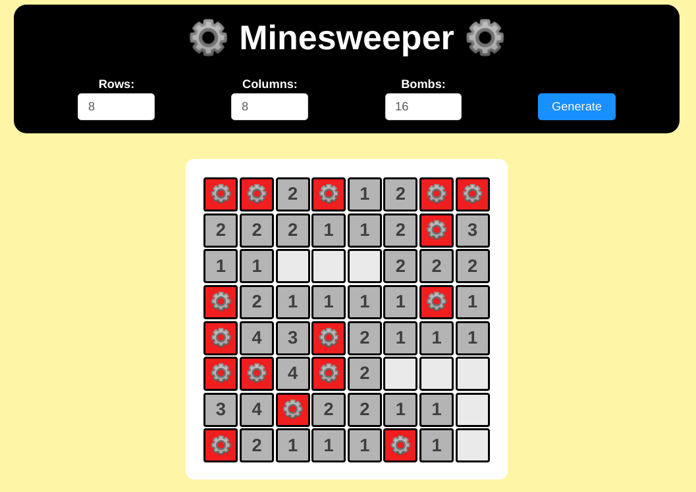

# Advance knowledge of Web development

# 1. Lý thuyết

## 1.1. HTTP và Restful API

### 1.1.1. AJAX

#### What is AJAX?

AJAX = Asynchronous JavaScript And XML.

AJAX is not a programming language.

AJAX just uses a combination of:

- A browser built-in XMLHttpRequest object (to request data from a web server)
- JavaScript and HTML DOM (to display or use the data)

> AJAX is a misleading name. AJAX applications might use XML to transport data, but it is equally common to transport data as plain text or JSON text.

AJAX allows web pages to be updated asynchronously by exchanging data with a web server behind the scenes. This means that it is possible to update parts of a web page, without reloading the whole page.

#### How AJAX Works


1. An event occurs in a web page (the page is loaded, a button is clicked)
2. An XMLHttpRequest object is created by JavaScript
3. The XMLHttpRequest object sends a request to a web server
4. The server processes the request
5. The server sends a response back to the web page
6. The response is read by JavaScript
7. Proper action (like page update) is performed by JavaScript

#### XMLHttpRequest Object

The XMLHttpRequest object can be used to exchange data with a web server behind the scenes. This means that it is possible to update parts of a web page, without reloading the whole page.

#### GET or POST?

GET is simpler and faster than POST, and can be used in most cases.

However, always use POST requests when:

- A cached file is not an option (update a file or database on the server).
- Sending a large amount of data to the server (POST has no size limitations).
- Sending user input (which can contain unknown characters), POST is more robust and secure than GET.

#### Asynchronous - True or False?

Server requests should be sent asynchronously.

The async parameter of the open() method should be set to true: `xhttp.open("GET", "ajax_test.asp", true);`

By sending asynchronously, the JavaScript does not have to wait for the server response, but can instead:

- execute other scripts while waiting for server response
- deal with the response after the response is ready

### 1.1.2. HTTP Method

#### What is HTTP?

The Hypertext Transfer Protocol (HTTP) is designed to enable communications between clients and servers.

HTTP works as a request-response protocol between a client and server.

A web browser may be the client, and an application on a computer that hosts a web site may be the server.

Example: A client (browser) submits an HTTP request to the server; then the server returns a response to the client. The response contains status information about the request and may also contain the requested content.

#### GET Method

GET is used to request data from a specified resource.

GET is one of the most common HTTP methods.

Note that the query string (name/value pairs) is sent in the URL of a GET request: `/test/demo_form.php?name1=value1&name2=value2`

Some other notes on GET requests:

- GET requests can be cached
- GET requests remain in the browser history
- GET requests can be bookmarked
- GET requests should never be used when dealing with sensitive data
- GET requests have length restrictions
- GET requests is only used to request data (not modify)

#### POST Method

POST is used to send data to a server to create/update a resource.

The data sent to the server with POST is stored in the request body of the HTTP request:

```
POST /test/demo_form.php HTTP/1.1
Host: w3schools.com
name1=value1&name2=value2
```

POST is one of the most common HTTP methods.

Some other notes on POST requests:

- POST requests are never cached
- POST requests do not remain in the browser history
- POST requests cannot be bookmarked
- POST requests have no restrictions on data length

#### PUT Method

PUT is used to send data to a server to create/update a resource.

The difference between POST and PUT is that PUT requests are idempotent. That is, calling the same PUT request multiple times will always produce the same result. In contrast, calling a POST request repeatedly have side effects of creating the same resource multiple times.

#### DELETE Method

The DELETE method deletes the specified resource.

#### HEAD Method

HEAD is almost identical to GET, but without the response body.

In other words, if GET /users returns a list of users, then HEAD /users will make the same request but will not return the list of users.

HEAD requests are useful for checking what a GET request will return before actually making a GET request - like before downloading a large file or response body.

#### OPTIONS Method

The OPTIONS method describes the communication options for the target resource.

#### Compare GET vs. POST

|   |**GET**|**POST**|
|:---|:---|:---|
|BACK button/Reload|Harmless|Data will be re-submitted (the browser should alert the user that the data are about to be re-submitted)|
|Bookmarked|Can be bookmarked|Cannot be bookmarked|
|Cached|Can be cached|Not cached|
|Encoding type|application/x-www-form-urlencoded|application/x-www-form-urlencoded or multipart/form-data. Use multipart encoding for binary data|
|History|Parameters remain in browser history|Parameters are not saved in browser history|
|Restrictions on data length|Yes, when sending data, the GET method adds the data to the URL; and the length of a URL is limited (maximum URL length is 2048 characters)|No restrictions|
|Restrictions on data type|Only ASCII characters allowed|No restrictions. Binary data is also allowed|
|Security|GET is less secure compared to POST because data sent is part of the URL. Never use GET when sending passwords or other sensitive information!|POST is a little safer than GET because the parameters are not stored in browser history or in web server logs|
|Visibility|Data is visible to everyone in the URL|Data is not displayed in the URL|

### 1.1.3. CORS

> Cross-Origin Resource Sharing

[CORS](https://auth0.com/blog/cors-tutorial-a-guide-to-cross-origin-resource-sharing/)

### 1.1.4. Session, Cookie, JWT

[Session and Cookie](https://techtalk.vn/session-va-cookies.html)

[Session vs JWT](https://techtalk.vn/json-web-tokens-jwt-vs-sessions.html)

### 1.1.5. Restful API là gì? Design Restful API như thế nào?

[Restfull API](https://medium.com/eway/nguyên-tắc-thiết-kế-rest-api-23add16968d7)

### 1.1.6. Server Render và Single Page App

#### Cơ chế server-side rendering

Gọi nó là server-side rendering là vì phần lớn logic sẽ được xử lý ở server:

- Khi người dùng vào một trang web, trình duyệt sẽ gửi GET request tới web server
- Web server sẽ nhận request, đọc dữ liệu từ database.
- Web server sẽ render HTML, trả về cho browser để hiển thị cho người dùng


Một số tính chất của cơ chế server side rendering:

- Logic từ đơn giản (validation, đọc dữ liệu) cho đến phức tạp (phân quyền, thanh toán) đều nằm ở phía server
- Logic để routing – chuyển trang nằm ở server
- Logic để render – hiển thị trang web cũng nằm ở server nốt

##### Ưu và nhược điểm của Server Side Rendering

Ra đời đã lâu, server side rendering đã được sử dụng, cải tiến rất nhiều (Caching, CDN). Những ưu điểm của cơ chế này:

- Initial load nhanh, dễ otpimize, vì toàn bộ dữ liệu đã được xử lý ở server. Client chỉ việc hiển thị.
- Các web framework từ xưa đến nay đều hỗ trợ cơ chế này
- Dễ hiểu và dễ code hơn. Developer chỉ cần code 1 project web là được, không cần phải tách ra front-end và back-end
- SEO tốt vì khi bot của Google, Bing vào web sẽ thấy toàn bộ dữ liệu dưới dạng HTML.
- Chạy được trên phần lớn mọi trình duyệt, kể cả disable JavaScript vẫn chạy tốt

Thế nhưng, bên cạnh đó, server side rendering cũng có một số nhược điểm:

- Mỗi lần người dùng chuyển trang là site phải load lại nhiều lần, gây khó chịu
- Nặng server vì server phải xử lý nhiều logic và dữ liệu. Có thể sử dụng caching để giảm tải.
- Tốn băng thông vì server phải gửi nhiều dữ liệu thừa và trùng  (HTML, header, footer). Có thể sử dụng CDN để giảm tải.
- Tương tác không tốt như Client Side rendering vì trang phải refresh, load lại nhiều lần.

Cơ chế server side rendering vẫn còn được sử dụng ở rất rất nhiều site. Do vậy, chỉ cần hiểu rõ và nắm vững cơ chế này là bạn đã có thể làm một trang web đầy đủ tính năng rồi.

Các trang web sử dụng cơ chế này:

- Toàn bộ những trang web được build từ CMS như Joomla, WordPress.
- Các trang web bán hàng, web tin tức: Thegioididong, Vnexpress, Zing News
- Các web đọc truyện và forum: Webtretho, vozforum

#### Cơ chế client-side rendering

Thế rồi, ở những năm 2010, với sự phát triển của JavaScript và AJAX, cơ chế client-side rendering bắt đầu được sử dụng.

Developer bắt đầu build ứng dụng dưới dạng SPA – Single Page Application. Ứng dụng nằm trong 1 page duy nhất nên được gọi là Single Page Application.

Client Side Rendering tức là việc render HTML, CSS sẽ được thực hiện ở client (Tức JavaScript ở trình duyệt)


So với Server Side Rendering (SSR) đã nhắc, Client Side Rendering (CSR) có những đặc điểm sau:

- Những logic đơn giản (validation, đọc dữ liệu, sorting, filtering) nằm ở client side
- Logic để routing (chuyển trang), render (hiển thị) dữ liệu thì 96.69% là nằm ở client side
- Logic phức tạp (thanh toán, phân quyền) hoặc cần xử lý nhiều (data processing, report) vẫn nằm ở server side.

##### Ưu nhược điểm của Client-side rendering

Ra mắt sau nên Client Side Rendering giải quyết được một số vấn đề của server side rendering:

- Page chỉ cần load một lần duy nhất. Khi user chuyển trang hoặc thêm dữ liệu, JavaScript sẽ lấy và gửi dữ liệu từ server qua AJAX. User có thể thấy dữ liệu mới mà không cần chuyển trang.
- Chuyển logic sang client nên giảm tải được một phần cho server.
- Giảm được băng thông do chỉ cần lấy JSON và dữ liệu cần thiết, thay vì phải lấy toàn bộ trang
- Với các ứng dụng cần tương tác nhiều, SPA hoạt động mượt mà hơn vì code chạy trên browser, không cần load đi loại lại nhiều

Tất nhiên là client side rendering cũng có một số nhược điểm riêng:

- Initial load sẽ chậm hơn nếu không biết optimize. Lý do là browser phải tải toàn bộ JavaScript về (khá nặng), parse và chạy JS, gọi API để lấy dữ liệu từ server (chậm), sau đó render dữ liệu
- Đòi hỏi project phải chia làm 2 phần riêng là back-end (REST api) và front-end nên khó code hơn
- Không chạy được nếu JavaScript bị disable, hoặc ở các trình duyệt cũ không nhận JavaScript ES6 (Có thể dùng transpiler và polyfill nhưng sẽ làm tăng kích cỡ file js)
- SEO không tốt bằng Server Side Rendering (Do bot crawl không đọc được dữ liệu). Để giải quyết, ta phải kết hợp thêm SSR (Bot mới của Google đọc được client-side rendering rồi).
- Nếu client sử dụng mobile, device yếu thì khi load sẽ bị chậm

Các website sử dụng Client-Side Rendering:

Vì Client-side rendering rất phù hợp cho những ứng dụng cần tương tác nhiều, hầu hết web của các công ty công nghệ, công ty startup đều đùng cơ chế này:

- Facebook (React)
- Instagram (React)
- Netflix (React)
- Dropbox (React)
- AirBnb (React)
- Trello (Angular)
- Paypal (Angular + React)
- Xiaomi (VueJS)
- Alibabe (VueJS)
- Gitlab (VueJS)

### 1.1.7. Các công cụ hỗ trợ thiết kế Restful API

#### 1.1.7.1. Swagger

[Swagger](https://gpcoder.com/5967-gioi-thieu-swagger-cong-cu-document-cho-restfull-apis/#Tim_hieu_ve_tai_lieu_huong_dan_su_dung_API)

#### 1.1.7.2. Postman

[Postman](https://viblo.asia/p/postman-cong-cu-tuyet-voi-de-lam-viec-voi-api-va-tao-api-documents-OeVKBoxMZkW)

## 1.2. ReactJS

- https://codeaholicguy.com/2016/03/01/hoc-reactjs-trong-15-phut-phan-1/
- https://codeaholicguy.com/2016/03/03/hoc-reactjs-trong-15-phut-phan-2/
- https://codeaholicguy.com/2016/03/08/hoc-reactjs-trong-15-phut-phan-cuoi/

### 1.2.1. ReactJS: principles, Component, State và Props, Life Cycle, JSX,...

### 1.2.2. Create-react-app, NextJS

### 1.2.3. React Router

### 1.2.4. State Management: Redux, MobX. Khi nào cần dùng một State Management?

### 1.2.5. Các React Framework: Ant.design, React Bootstrap, RechartsJS,...

# 2. Bài tập

**Đề bài**: `Minesweeper`



# 3. Tài liệu tham khảo

- [HTTP Methods](https://www.tutorialspoint.com/http/http_methods.htm)
- [Json Web Token](https://jwt.io/)
- [Restful API Design](https://hackernoon.com/restful-api-designing-guidelines-the-best-practices-60e1d954e7c9)
- [React Router](https://reacttraining.com/react-router/web/example/basic)
- [ReactJS Documentation](https://reactjs.org/docs/getting-started.html)
- [Ant.design](https://ant.design/)
- [Redux](https://insights.innovatube.com/redux-th%E1%BA%ADt-l%C3%A0-%C4%91%C6%A1n-gi%E1%BA%A3n-ph%E1%BA%A7n-1-76a3fa2c31ab)
- [Learn how to use JSON Web Tokens (JWT) for much Authentication win!](https://github.com/dwyl/learn-json-web-tokens)

- https://viblo.asia/p/tim-hieu-ve-ajax-al5XRBkkMqPe
- https://viblo.asia/p/tim-hieu-tong-quan-ve-jquery-ajax-PwRGgmmrkEd
- https://www.w3schools.com/js/js_ajax_intro.asp

- https://www.w3schools.com/tags/ref_httpmethods.asp

- https://auth0.com/blog/cors-tutorial-a-guide-to-cross-origin-resource-sharing/
- https://topdev.vn/blog/cors-la-gi/
- https://viblo.asia/p/cors-jvElaBNd5kw
- https://codeaholicguy.com/2018/05/07/cors-la-gi/

- https://techtalk.vn/session-va-cookies.html
- https://viblo.asia/p/session-cookie-va-cache-ban-da-thuc-su-hieu-chung-3P0lPv3PKox
- https://viblo.asia/p/cookie-va-session-07LKXEvEZV4
- https://techtalk.vn/json-web-tokens-jwt-vs-sessions.html

- https://restfulapi.net/rest-architectural-constraints/#code-on-demand
- https://medium.com/eway/nguyên-tắc-thiết-kế-rest-api-23add16968d7
- https://topdev.vn/blog/restful-api-la-gi/

- https://toidicodedao.com/2018/09/11/su-khac-biet-giua-server-side-rendering-va-client-side-rendering/
- https://kipalog.com/posts/Single-Page-Applications--Server-Side-Rendering--Client-Side-Rendering-and-so-on
- https://viblo.asia/p/server-side-rendering-client-side-rendering-single-page-applications-jvElaWYYKkw

- https://gpcoder.com/5967-gioi-thieu-swagger-cong-cu-document-cho-restfull-apis/
- https://viblo.asia/p/gioi-thieu-tool-swagger-ui-viet-document-cho-api-Qbq5QWRwZD8
- https://viblo.asia/p/tim-hieu-ve-swagger-de-viet-api-XL6lAwbAKek
- https://techblog.vn/tim-hieu-ve-swagger-de-viet-api
- https://viblo.asia/p/postman-cong-cu-tuyet-voi-de-lam-viec-voi-api-va-tao-api-documents-OeVKBoxMZkW
- https://viblo.asia/p/api-testing-su-dung-postman-gGJ592JrKX2

- https://codeaholicguy.com/2016/03/01/hoc-reactjs-trong-15-phut-phan-1/
- https://codeaholicguy.com/2016/03/03/hoc-reactjs-trong-15-phut-phan-2/
- https://codeaholicguy.com/2016/03/08/hoc-reactjs-trong-15-phut-phan-cuoi/