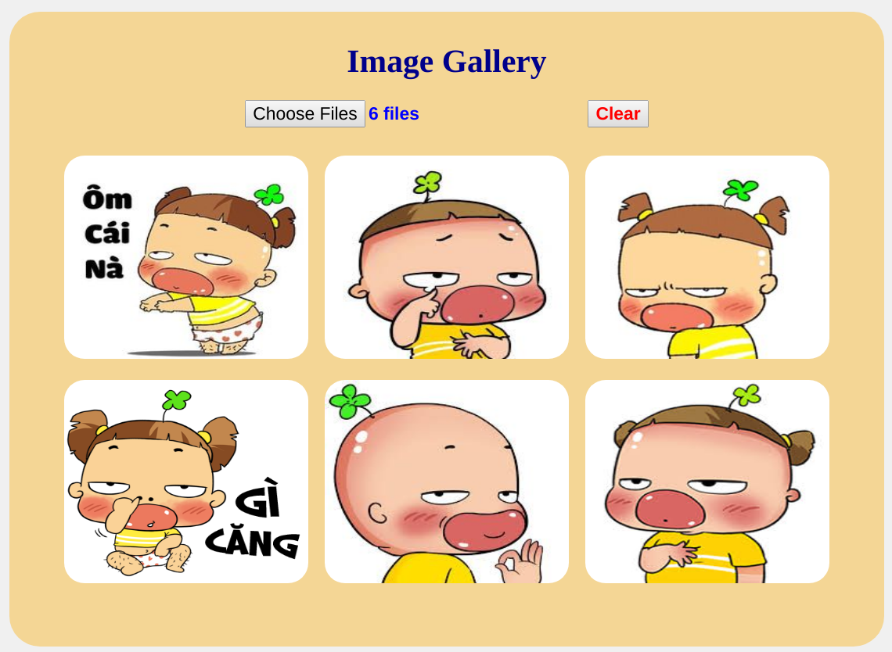

# Basic knowledge of Web development

# 1. Lý thuyết

## 1.1. Frontend Basic

### 1.1.1. HTML5

HTML5 là phiên bản mới nhất của HTML. Hai phiên bản này khá khác nhau. HTML5 là phiên bản mới về ngôn ngữ, thuộc tính và công nghệ mới cho phép xây dựng các trang web, ứng dụng đa dạng và mạnh mẽ hơn. Hai bản này thường được gọi là HTML5.

HTML5 được thiết kế để có thể sử dụng trên tất cả cá nhà phát triển web mở, trang này liên kết với nhiều tài nguyên công nghệ HTML5, phân thành nhiều nhóm dựa vào từng chức năng.

- **Semantics**: cho phép mô tả chính xác nội dung.
- **Connectivity**: cho phép giao tiếp với máy chủ theo nhiều cách.
- **Offline and storage**: cho phép các trang web lưu trữ dữ liệu ở máy khách hàng và hoạt động ngoại tuyến hiệu quả hơn.
- **Multimedia**: tạo video và âm thanh trong web mở.
- **2D/3D graphics and effects**: cho phép phạm vi trình bày đa dạng hơn.
- **Performance and integration**: tối ưu hóa tốc độ và phần cứng.
- **Device access**: cho phép sử dụng các thiết bị đầu vào và ra khác nhau.
- **Styling**: cho phép viết các chủ đề phức tạp.

**Khác biệt chính giữa HTML và HTML5**:

- SVG, canvas và những hình dạng vector đều được hỗ trợ bởi HTML5, khi HTML nếu muốn sử dụng hình vector chỉ có thể dùng nó trong một công nghệ khác như, Flash, VML và silver light.
- HTML5 sử dụng web SQL databases, application cache để lưu dữ liệu tạm, trong khi đó, HTML chỉ có cache của trình duyệt được dùng cho mục đích này.
- Một khác biệt nữa giữa HTML và HTML5 đáng nhắc đến là HTML không cho phép JavaScript chạy trong web browser (thay vì vậy nó chạy trong interface thread của browser), trong khi đó HTML5 hỗ trợ hoàn toàn cho JavaScript để chạy nền (nhờ vào JS web worker API của HTML5).
- HTML5 không dựa trên SGML, cho phép nó tăng luật parsing, có thể tương thích mạnh mẽ hơn
- Trong HTML5, inline MathML và SVG có thể được dùng trong văn bản nơi mà không được hỗ trợ trong HTML.
- Một số elements lỗi thời đã bị loại bỏ hoàn toàn là: isindex, noframes, acronym, applet, basefont, dir, font, frame, frameset, big, center, strike, tt.
- HTML5 hỗ trợ nhiều loại điều khiển form, ví dụ: ngày giờ, email, số lượng, khoảng, số điện thoại, URL, tìm kiếm, vâng vâng
- Có nhiều element được giới thiệu trong HTML. Một vài trong số chúng là quan trọng nhất: summary, time, aside, audio, command, data, datalist, details, embed, wbr, figcaption, figure, footer, header, article, hgroup, bdi, canvas, keygen, mark, meter, nav, output, progress, rp, rt, ruby, section, source, track, video.


### 1.1.2. CSS3

#### 1.1.2.1. Box Model


- Content: như đã nói ở trên đây là phần mà text và hình ảnh của chúng ta xuất hiện
- Padding: là một khoảng trống kế tiếp bọc xung quanh content
- Border: phần khung bao bọc xung quanh padding và content
Margin: cuối cùng, margin là phần ngoài cùng của Box Model, chỉ là một khoảng trống không màu

##### Content

Tiếp tục nhắc lại content là phần xuất hiện của text và hình ảnh, phần này không có gì đặc biệt để nói cho lắm, tổng kích cở của text bao nhiêu (có thể lớn nhỏ nếu chúng ta tùy chỉnh font-size) hay hình ảnh bao lớn thì đó cũng là kích cở của content. Tuy nhiên, có một điều cần chú ý là content và hai thuộc tính height và width, khi chúng ta đặt một height hay một width hoặc thậm chí cả hai cho một element thì height và width này chỉ tác động lên một vùng duy nhất đó là content chứ không hề đá động gì đến padding, border hay margin cả. Vậy, phần kích thước đầu tiên của Box Model đó chính là content.

##### Padding

Nói đơn giản về padding thì nó là thuộc tính dùng để tạo ra một vùng khoảng trống bao bọc xung quanh content và nó sẽ nằm bên trong border. Khi xét padding cho một element ta có thể xét theo 2 kiểu:

- Xét theo từng bên của element: top, right, bottom và left như sau:
    - padding-top
    - padding-right
    - padding-bottom
    - padding-left
- Hay là xét theo kiểu viết tắc:
    - padding: 5px 6px 8px 7px (top right bottom left)
    - padding: 5px 6px 7px (top right&left bottom)
    - padding: 5px 6px (top&bottom right&left)
    - padding: 5px (cho toàn bộ 4 mặt)

Và chúng ta có các đơn vị để xét padding như:

- "Đơn vị đo chiều dài" như: cm, px, em, etc
- Phần trăm (%): cái % này sẽ phụ thuộc vào width của thằng element chứa nó
- Inherit: kế thừa cái padding đã được xét ở element mẹ (hay bố cũng được)

Có một điều cần lưu ý nữa là giữa padding và width. Ví dụ chúng ta cho một thằng divvới thuộc tính như sau:

```css
div{
    width:350px;
    padding:25px;
}
```

Thì như đã nói ở trên thằng width là chỉ xét cho mỗi phần content có nghĩa là giờ phần content của mình nó dài 350px chưa kể padding. Vậy để tính được hết chiều dài của cái div này thì mình phải cộng thêm 50px nửa (25px padding bên trái và 25px padding bên phải) => tổng chiều rộng của cái div là 400px.


##### Border

Border, lớp tiếp theo của Box Model, bỏ qua các phần trang trí màu mè của nó, chúng ta chỉ xét tới các phần như border-width hay xét border cho các mặt của element. Thứ nhất, nói sơ qua cấu trúc border thì nó sẽ gồm có:

- border-width: độ rộng của border tính bằng các đơn vị như: in px, pt, cm, em, etc
- border-style: style cho border như kiểu đường thằng, chấm bi, song nét,... (solid, dotted, double,.. )
- border-color: màu cho border và được xét bởi nhiều cách: tên màu, giá trị hexa, giá trị rgb hay là trong suốt (transparent)

Hoặc cả đống trên có thể ghi tắc lại thành `border: chiềurộng kiểu màu` ví dụ `border:2px solid black`, đó là xét cho tất cả 4 phía: top, right, bottom và left, nếu muốn chúng ta có thể xét riêng cho từng phía với từng kiểu như sau:

- border-top
- border-right
- border-bottom
- border-left

Việc xét cho toàn bộ border hay xét cho từng phía sẽ gây ảnh hưởng khác nhau đến Box Model, lấy lại ví dụ ở padding lúc nãy

```css
div{
    width:350px;
    padding:25px;
}
```

Như trên là chúng có ta một div với chiều rộng là 400px nếu chúng ta thêm vào dòng border:5px solid orange thì chiều rộng của div sẽ lên là 410px vì nó được cộng thêm 5px của border bên trái và 5px của border bên phải. Tuy nhiên, nếu ta chỉ thêm vào border-left:5px solid orange thì chiều rộng của div chỉ là 405px vì chỉ có 5px của border trái còn bên phải thì làm gì có mà thêm.

##### Margin

Lớp cuối cùng của Box Model đó chính là lớp margin bên ngoài, margin là một thuộc tính dùng để tạo khoảng cách xung quanh element để cách element đó với các thứ khác và phần margin sẽ nằm bên ngoài border. Giống như padding thì margin cũng được xét theo hai kiểu, một là:

- margin-top
- margin-right
- margin-bottom
- margin-left

Và thứ hai là viết tắc tương tự như padding. Về phần đơn vị, margin cũng có các kiểu: "đơn vị đo độ dài", % hay inherit như padding. Tuy nhiên, margin còn có thêm một giá tị nửa, đó chính là margin:auto. Khi ta dùng cái auto này thì trình duyệt sẽ tự động tính toán và đặt lại khoảng cách cho element sao cho nó được căn ngay chính giữa bên trong container chứa nó.

Một vấn đề cuối cùng của margin đó là margin collapse, chúng ta sẽ đưa ra một ví dụ để có thể dễ dàng giải thích. Ví dụ: Chúng ta sẽ cho 2 element h1 và h2 nằm trong một div có class là "left" như sau:

```css
<div class="left">
    <h1>Hello</h1>
    <h2>Holle</h2>
</div>
```

và tiếp tục ta sẽ cho element h1 với margin-bottom là 50px và element h2 với margin-top là 20px.

```css
div.left h1{
    margin-bottom:50px;
}
div.left h2{
    margin-top:20px;
}
```

Nếu như xem ở trên xong chúng ta sẽ nghĩ rằng 2 thằng h1 và h2 này sẽ cách nhau là 70px (50px + 20px). Tuy nhiên, do margin collapse này mà 2 element h1 h2 của chúng ta chỉ cách nhau có 50px


Để rõ ràng, chúng ta sẽ viết thêm một div khác với class là "right" và vẫn với 2 dòng HTML của h1 và h2 kia. Tuy nhiên, chúng ta sẽ chỉ cho h1 có margin-bottom là 70px để so sánh.

```css
div.right h1{
    margin-bottom:70px;
}
```

Và đây là kết quả của chúng ta:


Như chúng ta đã thấy, bên phía class "left" mặc dù có cả margin-bottom:50px của h1 và margin-top:20px của h2 nhưng khoảng cách vẫn chỉ là 50px bé hơn so với khoảng cách một margin-bottom:70px của h1 bên class "right". Đó chính là margin collapse.

Tóm lại, dựa trên kiến thức của Box Model, nếu ta chúng ta có một element div chẳng hạn được viết như thế này:

```css
div{
    background-color:#1abc9c;
    width:300px;
    padding:30px;
    border:10px solid black;
    margin:20px;
}
```


Thì độ rộng của nó sẽ là 420px được tính như sau: (tạm gọi là total)
total = width + right padding + left padding + right border + left border + right margin + left margin
total = 300px + 30px + 30px + 10px + 10px + 20px + 20px = 420px.

#### 1.1.2.2. Flexbox

Flexbox là một kiểu dàn trang (layout mode) mà nó sẽ tự cân đối kích thước của các phần tử bên trong để hiển thị trên mọi thiết bị. Nói theo cách khác, bạn không cần thiết lập kích thước của phần tử, không cần cho nó float, chỉ cần thiết lập nó hiển thị chiều ngang hay chiều dọc, lúc đó các phần tử bên trong có thể hiển thị theo ý muốn.

##### Cấu trúc


Hai thành phần quan trọng nhất trong một bố cục Flexbox là gồm container và item:

- **container**: là thành phần lớn bao quanh các phần tử bên trong, bạn sẽ thiết lập kiểu hiển thị inline (sắp xếp theo chiều ngang) hoặc kiểu sắp xếp theo chiều dọc. Khi đó, các item bên trong sẽ hiển thị dựa trên thiết lập của container này.
- **item**: Các phần tử con của container được gọi là item, ở item bạn có thể thiết lập nó sẽ sử dụng bao nhiêu cột trong một container, hoặc thiết lập thứ tự hiển thị của nó.

Ngoài hai thành phần chính đó, chúng ta có thể thấy hình trên sẽ có:

- **main start**, **main end**: Khi thiết lập flexbox, điểm bắt đầu của container gọi là main start và điểm kết thúc được gọi là main end. Điều này có nghĩa, các item bên trong sẽ heienr thị từ main start đến main end (hoặc là được phép hiển thị đến main end). Và chiều vuông góc của nó là cross start, cross end cũng có ý nghĩa tương tự nhưng luôn vuông góc với main start, main end.
- **main axis**: Trục này là trục chính để điều khiển hướng mà các item sẽ hiển thị. Như bạn thấy ở trên hình main axis là trục dọc nên các item sẽ hiển thị theo chiều dọc, tuy nhiên ta có thể sử dụng thuộc tính flex-direction để thay đổi trục của main axis và lúc đó các item sẽ hiển thị theo nó. Và cross axis luôn là trục vuông góc của main axis.
- **main size**: Bạn có thể hiểu đơn giản là kích thước (chiều rộng hoặc dọc) của mỗi item dựa theo trục main axis.
- **cross size**: Là kích thước (chiều rộng hoặc dọc) của mỗi item dựa theo trục cross axis.

##### Bắt đầu với Flexbox

Bạn sẽ thấy các item bên trong đã tự hiển thị theo chiều dọc, tương ứng với trục main axis mặc định là chiều ngang.


Nếu bạn muốn đổi trục thì chỉ cần thêm thuộc tính flex-direction vào container. Cụ thể:

```css
flex-direction: row | column | row-reverse | column-reverse
```

- flex-direction:
    - row: Chuyển trục main axis thành chiều ngang, nghĩa là hiển thị theo hàng.
    - column: Chuyển trục main axis thành chiều dọc, nghĩa là hiển thị theo cột.
    - row-reverse: Hiển thị theo hàng nhưng đảo ngược vị trí các item.
    - column-reverse: Hiển thị theo cột nhưng đảo ngược vị trí các item.


**flex-wrap**

Bây giờ để hiểu cái này, chúng ta thử thêm chiều rộng cho mỗi item bên trong là 1000px xem chuyện gì sẽ xảy ra khi dùng flexbox.

```css
.item {
 width: 1000px;
}
```


Như bạn thấy, dù chúng ta có thêm chiều rộng cho mỗi item bên trong là 1000px nhưng nó vẫn hiển thị trên một hàng đều nhau. Lý do là mặc định, flexbox tự căn chỉnh các phần tử hiển thị đều nhau theo trục main axis của nó dựa theo chiều rộng của container. Vì vậy cho dù bạn có chỉnh chiều rộng vượt quá giới hạn của nó thì nó vẫn không bị nhảy lung tung.

Bây giờ hãy thử thêm thuộc tính flex-wrap: wrap vào container.

```css
.container {
 display: flex;
 flex-wrap: wrap;
}
```


Nói nôm na là thuộc tính này cho phép container có thể bọc lại các item kể cả khi kích thước của item bị thay đổi, mặc định là nowrap. Thuộc tính này có thể áp dụng với cả chiều dọc của container và item. Các bạn xem video ở trên để rõ hơn.

**order**

Trong đoạn HTML ví dụ của mình trong bài này, mình có đặt số thứ tự cho mỗi phần tử là 1, 2, 3 và 4 với class tương ứng là .item1, .item, .item3 và .item4. Mặc định item này sẽ hiển thị theo thứ tự trong HTML, nhưng với thuộc tính order chúng ta có thể sắp xếp lại vị trí sắp xếp của các item.


Mặc định thứ tự sắp xếp sẽ bắt đầu từ bên trái qua phải, từ trên xuống dưới. Nếu bạn chỉnh lại trục của main axis với thuộc tính `flex-direction` nó sẽ thay đổi ngược lại.

**flex-grow**

Để làm ví dụ này trước tiên mình hãy bỏ chức năng wrap đi và thiết lập chiều rộng của item là 50px.

```css
.item {
 width: 50px;
}
```

Bây giờ ở .item2, mình cho giá trị flex-grow là 1

```css
.item2 {
 flex-grow: 1;
}
```


Khi thiết lập nó flex-grow là 1, thì nó sẽ lấy phần trống còn lại của container đắp vào. Bây giờ hãy thử cho .item1 với flex-grow: 2 thử.

```css
.item1 {
 flex-grow: 2;
}
```


Lúc này giá trị flex-grow: 2 sẽ lấy phần dư lớn gấp đôi của flex-grow: 1.

**flex-shrink**

Bạn có thể hiểu mặc định tất cả các item đều có giá trị flex-shrink là 1. Điều này có nghĩa là khi chúng ta thu nhỏ trình duyệt lại, các phần tử đều co lại bằng nhau. Tuy nhiên giả sử mình muốn .item3 nó co lại nhiều hơn so với các item khác thì mình sẽ tăng giá trị flex-shrink của nó lên.

```css
.item3 {
 flex-shrink: 2;
}
```


**flex-basis**

Cái này bạn có thể hiểu đơn giản nhất là gán cho item một kích thước nhất định. Bạn có thể sử dụng giá trị tuyệt đối hoặc tương đối (căn cứ theo kích thước của container).

```css
.item3 {
 flex-basis: 500px;
}
```


**justify-content**

Mặc định các item bên trong sẽ rải đều bắt đầu từ main start đến main end, tuy nhiên nếu container vẫn còn khoảng trống thì có thể dùng thuộc tính justify-content để điều chỉnh lại vị trí bắt đầu của nó.

Thuộc tính này có 5 giá trị và bạn có thể xem tấm ảnh bên dưới mình mượn của CSS Tricks để hiểu hơn về ý nghĩa các giá trị của justify-content.


Đây là ví dụ:

```css
.container {
 display: flex;
 justify-content: flex-end;
}
```


#### 1.1.2.3. Media Queries

##### Media Query là gì?

Media Query là một trong những module mới được thêm vào trong CSS3. Nó là một sự cải thiện của Media Type đã có từ CSS2, bằng việc thêm vào những cú pháp query để ta có thể đáp ứng được cho nhiều device với nhiều kích cỡ màn hình khác nhau.

Module Media Query hiện đã được implement đầy đủ trong các trình duyện hiện đại như Webkit, Firefox, Opera hay IE (kể từ version 9).

##### Media Type

Trước khi tìm hiểu về cú pháp của Media Query, trước hết ta hãy nói qua về Media Type trước.

Media Type vốn đã có từ CSS2, nó giúp ta xác định định dạng của mỗi loại thiết bị. Tất cả các giá trị của Media Type bao gồm:

- All: Dùng cho tất cả các loại Media Type
- Aural: Dùng cho speech and sound synthesizers
- Braille: Dùng cho các devices liên quan đến chữ nổi (braille)
- Embossed: Dùng cho các loại máy in các trang braille
- Handheld: Dùng cho các thiết bị nhỏ, thiết bị cầm tay
- Print: Dùng cho máy in
- Projection: Dùng cho các loại máy chiếu
- Screen: Dùng cho computer screen
- Tty: Dùng cho các thiết bị sử dụng fixed-pitch character grid
- Tv: Dùng cho các loại TV

Ta có thể sử dụng Media Type theo cú pháp sau đây: `@media media_type {rules}`

Chẳng hạn như ta có đoạn code sau:

```css
/*Áp dụng cho computer screens*/
@media screen {
  body {
    width: 960px;
  }
}
/*Áp dụng cho các thiết bị cầm tay nhỏ*/
@media handheld {
  body {
    width: 320px
  }
}
```

Chú ý rằng từ HTML5 thì giá trị default của media type là all, thế nên mặc định thì các CSS rules của bạn viết sẽ được áp dụng cho tất cả các loại màn hình.

##### Media Query Syntax

Cú pháp của Media Query được mở rộng ra từ cú pháp của Media Type như sau: `@media media_type (feature:value) { rules }`

Các thuộc tính feature và value sẽ giúp chúng ta xác định chính xác từng loại màn hình mà ta mong muốn.

Đôi khi có những Media Feature mà một mình nó đứng không cũng có ý nghĩa, mà không cần đến value, thì cú pháp của ta sẽ như sau: `@media media_type (feature) { rules }`

Ngoài ra thì như đã nói mặc định của Media Type sẽ luôn là `all`, thế nên ta có thể lược bỏ phần `media_type` ở trên nếu muốn nó được apply cho tất cả các devices.

##### Một số Media Feature quan trọng

- `width`, `height`: Nếu sử dụng feature này thì các css rules sẽ chỉ được áp dụng cho những browser có chiều rộng hoặc chiều cao đúng với thông số mà ta đã đưa ra. Chẳng hạn như @media (width: 900px) {rules} thì sẽ chỉ áp dụng cho những browser nào có kích cỡ chiều rộng đúng bằng 900px. Thế nên hai feature này rất ít khi được sử dụng. Thay vào đó người ta thêm các tiền tố min- hay max- và để được các feature sau: min-width, min-height, max-width, max-height. Đây là feature cho phép ta thiết lập những rules cho những browser có chiều rộng hay chiều dài nằm trong một khoảng nào đó. Ví dụ:

```css
/*Áp dụng cho những browser có chiều rộng <= 900px*/
@media (max-width: 900px) { body {font-size: 16px;} }
/*Áp dụng cho những browser có chiều rộng >= 600px*/
@media (min-width: 600px) { body {font-size: 14px;} }
/*Áp dụng cho những browser có chiều rộng >= 800px*/
@media (min-width: 800px) { body {font-size: 15px;} }
/*Áp dụng cho những browser có chiều rộng <= 700px*/
@media (max-width: 700px) { body {font-size: 13px;} }
```

Cần chú ý là những rules khai báo sau sẽ đè lên những rules khai báo trước, vậy nên với đoạn code bên trên thì nếu browser của bạn có chiều rộng là 650px thì rule được áp dụng ở đây sẽ là font-size: 13px;, còn chiều rộng là 750px thì rule được áp dụng sẽ là font-size: 15px;.

- `device-width`, `device-height`, `device-min-width`, `device-max-width`, `device-min-height`, `device-max-height`: Cũng giống như width, height hay min-width, min-height, max-width, max-height, thế nhưng với việc thêm device- ở phía trước thì các tính toán sẽ được dựa trên kích cỡ của thiết bị, thay vì kích cỡ của browser.
- `aspect-ratio` và `device-aspect-ratio`: Đây là những feature cho phép ta áp dụng các rules dựa trên tỉ lệ của browser hay tỉ lệ của thiết bị. Ta có thể dùng các thông số như 16/9 hay 16/10, hoặc có thể viết cả kích cỡ cụ thể ra cho dễ đọc như 1280/720 chẳng hạn. Hai feature này cũng có thể sử dụng các tiền tố min- hay max-
- `resolution`: Đây là những feature đánh giá dựa trên độ phân giải của màn hình device (đương nhiên là không có độ phân giải cho browser rồi). Feature này cũng có thể sử dụng các tiền tố min- hay max-. Ví dụ:

```css
/*Sử dụng đơn vị là dpi: dots per inch*/
@media (max-resolution: 300dpi) { body {font-size: 15px;} }
/*Sử dụng đơn vị là dpcm: dots per centimeter*/
@media (min-resolution: 600dpcm) { body {font-size: 14px;} }
```

- `orientation`: Đây là những feature đánh giá dựa trên trạng thái của thiết bị đang là là portrait (xoay dọc: khi mà chiều dài >= chiều rộng, hay là landscape (quay ngang: chiều dài < chiều rộng). Ví dụ:

```css
/*Áp dụng khi device để dọc*/
@media (orientation: portrait) { body {font-size: 14px;} }
/*Áp dụng khi device để ngang*/
@media (orientation: landscape) { body {font-size: 15px;} }
```

- Ngoài ra còn một số features khác, mà có thể ít được sử dụng hơn, đó là color, color-index, monochrome, scan và grid

```css
/*Áp dụng cho màn hình màu*/
@media (color) { body {font-size: 14px;} }
/*Áp dụng cho màn hình có ít nhất 256 màu*/
@media (min-color-index: 256) { body {font-size: 15px;} }
```

Ta có thể ghép nhiều media feature vào trong một câu lệnh kiểm tra bằng toán tử `and` hoặc `,` (mang ý nghĩa của phép or). Ngoài ra ta cũng có thể sử dụng `not` hoặc `only`.

Khi ta viết: `@media (color) { body {font-size: 14px;} }`

như ở trên thì do `all` được mặc định lược bỏ, nên nó tương đương với: `@media all and (color) { body {font-size: 14px;} }`

Ngoài ra ta có các ví dụ khác như sau:

```css
/*Áp dụng cho browser có chiều rộng >=800px và <= 900px*/
@media (max-width: 900px) and (min-width: 800px) { body {font-size: 14px;} }
/*Áp dụng cho màn hình nằm ngang hoặc có chiều rộng >=1200px */
@media (orientation: landscape), (device-min-width: 1200px) { body {font-size: 15px;} }
/*Áp dụng cho màn hình có tỉ lệ không phải là 4/3*/
@media not (device-aspect-ratio: 4/3) { body {font-size: 15px;} }
```

##### Sử dụng Media Query hiệu quả

Có 3 cách để sử dụng Media Query. Cách thứ nhất, như đã đề cập ở phía trước, đó là sử dụng từ khoá `@media` để tính toán rules bên trong một stylesheet: `@media (expression) { body {font-size: 15px} }`

Cách thứ hai đó là khai báo trong tag link với thuộc tính là media. Như vậy ta có thể gọi đến hẳn mốt stylesheet bên ngoài.

```css
<!--Sẽ load external stylesheet được khai báo nếu thoả mãn điều kiện của media feature -->
<link href="external files link" rel="stylesheet" media="all and (expression)">
```

Cách thứ 3 đó là sử dụng từ khoá `@import` để load một external stylesheet bên trong một external stylesheet.

```css
/* Sẽ load external stylesheet được khai báo nếu thoả mãn điều kiện của media feature */
@import url('file') all and (expression);
```

`Nên dùng Media Query để gọi đến external stylesheet nếu có thể`. Nếu có thể hãy viết tách bạch những CSS rules dành cho những thiết bị khác nhau ra những stylesheet khác nhau, sau đó gọi qua tag link của html như đã đề cập ở trên. Nó sẽ giúp cho công việc quản lý và chỉnh sửa sau này trở nên dễ dàng hơn. Đương nhiên bạn nên viết một stylesheet chung cho tất cả các device/browser trước, sau đó sẽ load riêng các stylesheet cho từng loại khác nhau, và những rules mới được load sẽ đè lên những rules cũ. Vì thế ta chỉ cần khai báo những CSS rules mà thực sự cần thay đổi với từng loại device/browser mà thôi.

`Nên viết, và load CSS rules của Desktop (những thiết bị có màn hình rộng) trước hay là Mobile (những thiết bị có màn hình bé) trước?` Chắc nhiều người sẽ nghĩ ngay đến việc nên thiết kế cho Desktop trước, bởi dù gì cũng dễ hơn, thuận lợi cho việc test hơn ... Thế nhưng đúng ra là nên viết cho Mobile trước. Chẳng hạn khi ta cần viết CSS cho các thiết bị mobile và desktop, thì trước hết ta nên viết một file là basic.css, và nó chứa rules dành cho thiết bị mobile. Sau đó viết một file là desktop.css và nó chứa rules dành cho các thiết bị có màn hình lớn. Và ta sẽ load như sau:

```css
<link href="basic.css" rel="stylesheet" media="all">
<link href="desktop.css" rel="stylesheet" media="min-device-width: 640px">
```

**Tại sao lại nên làm như vậy?**

Đó là bởi giao diện dành cho những thiết bị màn hình lớn bao giờ cũng chứa những hình ảnh với kích cỡ to, và độ phân giải cao hơn so với những thiết bị màn hình nhỏ. Do đó nếu ta để những rules dành cho Desktop vào basic, và load trước thì bao giờ những assets có dung lượng tương đối lớn đó cũng được load. Giả dụ như ta có thêm trường display: none vào để ẩn nó đi trên những màn hình nhỏ đi chăng nữa thì nó vẫn được load vào lưu vào cache, điều đó dẫn đến tốc độ duyệt trang web của ta sẽ bị ảnh hưởng khi sử dụng các thiết bị mobile. Bởi vậy, nếu bạn muốn hiển thị nhiều hình ảnh cho Desktop thì hãy viết ra một external stylesheet riêng, và hãy thiết lập Media Query để nó chỉ được load khi thiết bị truy cập có màn hình lớn mà thôi.

### 1.1.3. Responsive Web Design

#### Responsive Web Design là gì?

Responsive Web Design là làm cho trang web của bạn có thể xem tốt trên tất cả các thiết bị. Responsive Web Design chỉ sử dụng HTML và CSS. Responsive Web Design không phải là một chương trình hoặc đoạn mã JavaScript.

**Thiết kế mang lại trải nghiệm tốt nhất cho người dùng**

Các trang web có thể được xem bằng nhiều thiết bị khác nhau: máy tính để bàn, máy tính bảng và điện thoại. Trang web của bạn nên nhìn đẹp và dễ sử dụng trên bất kể thiết bị nào. Các trang web không nên để nội dung tràn ra ngoài trên các thiết bị có kích thước nhỏ, mà phải thích ứng với nội dung của nó để phù hợp với bất kỳ thiết bị nào. Hình ảnh dưới đây sẽ mô tả đơn giản một ví dụ về RWD.


Và nó được gọi là RWD khi bạn sử dụng CSS và HTML để thay đổi kích thước, ẩn, co lại, phóng to hoặc di chuyển nội dung để làm cho bố cục trang web trở nên tương thích ở bất kỳ màn hình nào.

#### Responsive Web Design - Viewport

**Viewport là gì?**

Viewport tạm dịch là khung nhìn, là khu vực có thể nhìn thấy của người dùng về nội dung trong một trang web. Viewport sẽ khác nhau với các thiết bị khác nhau, và sẽ nhỏ hơn trên điện thoại di động so với trên màn hình máy tính. Trước khi thiết kế cho máy tính bảng và điện thoại di động, các trang web chỉ được thiết kế cho màn hình máy tính và thông thường các trang web có thiết kế tĩnh và có kích thước cố định. Sau đó, khi chúng ta bắt đầu lướt web bằng cách sử dụng máy tính bảng và điện thoại di động, các trang web có kích thước cố định đã quá lớn để phù hợp với người dùng. Để khắc phục điều này, các trình duyệt trên các thiết bị này tự động thu nhỏ toàn bộ trang web để vừa với màn hình. Khi chiều ngang của thiết bị quá nhỏ, người dùng phải vuốt ngang để xem hết nội dung của trang web hoặc xem trang web với nội dung quá nhỏ và cần phải zoom để đọc được nội dung. Rõ ràng, đây là một trải nghiệm không tốt chút nào cho người dùng.

**Thiết lập Viewport**

HTML5 giới thiệu một phương pháp để cho phép các nhà thiết kế web kiểm soát viewport, thông qua thẻ `<meta>`. Bạn có thể thiết lập meta viewport bằng cách đặt vào trong cặp thẻ `<head>` như sau: `<meta name="viewport" content="width=device-width, initial-scale=1">`

- Thẻ `<meta>` viewport thiết lập cho trang web hiển thị tương ứng với kích thước của từng thiết bị khác nhau.
- Thuộc tính `width=device-width` đặt chiều rộng của trang web theo chiều rộng màn hình của thiết bị.
- Thuộc tính `initial-scale=1.0` thiết lập mức độ phóng ban đầu khi trang được trình duyệt tải lần đầu tiên, người dùng sẽ không thể zoom khi thuộc tính này có giá trị bằng 1.

#### Quy tắc khi thực hiện Responsive Web Design

Nội dung web phải luôn nằm trong giới hạn kích thước của chiều ngang màn hình, người dùng chỉ cần cuộn dọc từ trên xuống để xem được hết nội dung của trang web dễ dàng. Vì vây, nếu để người dùng phải cuộn ngang hoặc zoom trang web mới xem được toàn bộ nội dung sẽ không phải là RWD và dẫn đến trải nghiệm người dùng kém. Một sổ quy tắc khác cần tuân thủ trong khi làm RWD: 
1. Không sử dụng các HTML element có chiều rộng cố định quá lớn - Ví dụ: Một hình ảnh có chiều rộng quá lớn so với chiều rộng của các thiết bị nhỏ thì khi hiển thị trên các thiết bị này hình ảnh sẽ bị tràn ra ngoài và cần phải cuộn ngang để xem được toàn bộ ảnh. Vì vậy, cần phải điều chỉnh hỉnh ảnh sao cho phù hợp với chiều rộng của từng thiết bị. 
2. Sử dụng CSS media queries để style cho từng thiết bị có chiều rộng khác nhau - Không nên sử dụng các giá trị tuyệt đối như px, pt cho các phần tử mang tính bao quát trong trang, điều này sẽ làm cho nội dung của trang web sẽ bị tràn khi xem ở thiết bị có chiều rộng nhỏ hơn giá trị đã thiết lập. Thay vì vậy, hãy sử dụng các giá trị mang tính tương đối như %, ví dụ như width: 100%. 
3. Sử dụng icon SVG thay cho icon hỉnh ảnh thông thường (JPG, PNG,...) Các icon, hình ảnh dạng SVG sẽ không bị mờ khi thu phóng ở bất kỳ kích thước nào, điều này sẽ giúp nội dung của trang web hiển thị tốt nhất trên các thiết bị Retina như iPhone, iPad, Macbook,...

#### Grid-View

**Grid-View là gì?**

Các trang web được dựa trên một Grid-View, có nghĩa là trang được chia thành các cột, việc xây dựng 1 Grid-View chuẩn sẽ giúp công việc thực hiện responsive về sau này thuận lợi hơn rất nhiều. Xem hình minh họa dưới đây để hình dung thế nào là 1 Grid-View.


Sử dụng Grid-View rất hữu ích khi thiết kế các trang web, nó giúp bạn dễ dàng đặt các phần tử trên trang. Hình dưới đây minh họa cho 1 trang web bao gồm header, footer, 2 sidebar và phần content ở giữa, bố cục của trang web này được phân chia dựa trên 1 Grid-View.


1 Grid-View thường có 12 cột và có tổng chiều rộng là 100%, sẽ tự động co giãn khi bạn thay đổi kích thước cửa sổ trình duyệt.

### 1.1.4. Màu sắc trong thiết kế Web

[UI-UX](https://gitlab.zalopay.vn/vuongvx/ui-ux)


### 1.1.5. Một số CSS Framework

#### 1.1.5.1. Bootstrap

[Overview Bootstrap](https://viblo.asia/p/thu-vien-bootstrap-4P856a8AlY3)

#### 1.1.5.2. Semantic UI

[Overview Semantic UI](https://techblog.vn/tong-quan-ve-semantic-ui)

## 1.2. JavaScript

### 1.2.1. JavaScript Syntax

[JS Syntax](https://www.w3schools.com/js/js_syntax.asp)

### 1.2.2. Async trong JavaScript

Khi lập trình JavaScript, bạn sẽ thường xuyên phải thực hiện các công việc mất thời gian như: request lên server, lấy dữ liệu từ database, đọc/ghi file,... Nếu bạn chỉ xử lý đồng bộ thôi thì chắc chắn sẽ rất mất thời gian. Để giải quyết vấn đề này, JavaScript cung cấp một số công cụ hỗ trợ bạn xử lý bất đồng bộ rất tốt như sử dụng callback, promise hay async/await.

Ta sẽ tìm hiểu xem xử lý bất đồng bộ là gì? Tại sao phải xử lý bất đồng bộ? Và các cách để xử lý bất đồng bộ trong JavaScript.

Giả sử bạn có một nhiệm vụ bao gồm 2 công việc tốn thời gian, tạm gọi là A và B.

**Xử lý đồng bộ**

Đối với xử lý đồng bộ, bạn sẽ thực hiện công việc A; đợi A hoàn thành xong thì sẽ thực hiện B; rồi lại đợi B hoàn thành thì nhiệm vụ cuối cùng mới coi như xong.


Nghĩa là thời gian để hoàn thành nhiệm vụ là tổng của thời gian hoàn thành A và B. Hơn nữa, trong khoảng thời gian này bạn sẽ không thể thực hiện thêm 1 hành động nào khác (như bắt các sự kiện với chuột và bàn phím của người dùng...). Điều này rõ ràng làm giảm hiệu năng và trải nghiệm người dùng đối với chương trình.

**Xử lý đa luồng**

Để khắc phục tình trạng này, các ngôn ngữ lập trình như C/C++, Java,... sẽ sử dụng cơ chế đa luồng (multi-thread). Nghĩa là mỗi công việc tốn thời gian sẽ được thực hiện trên một thread riêng biệt mà không can thiệp vào thread chính. Bạn vẫn có thể thực hiện các công việc tốn thời gian mà vẫn có thể bắt các sự kiện ở thread chính.


Với ví dụ trên, thời gian để hoàn thành nhiệm vụ sẽ chỉ bằng thời gian hoàn thành của A hoặc B. Cái nào thực hiện xong trước sẽ đợi cái còn lại hoàn thành thì nhiệm vụ sẽ kết thúc.

**Xử lý bất đồng bộ**

Tuy nhiên, JavaScript lại là một câu chuyện khác. Hai nền tảng quan trọng với JavaScript (trình duyệt và Nodejs) đều là single-thread. Chính vì vậy, bạn không thể xử lý đa luồng với JavaScript được mà phải sử dụng cơ chế xử lý bất đồng bộ.


Với cách xử lý bất đồng bộ, khi A bắt đầu thực hiện, chương trình tiếp tục thực hiện B mà không đợi A kết thúc. Việc mà bạn cần làm ở đây là cung cấp một phương thức để chương trình thực hiện khi A hoặc B kết thúc.

Cơ chế giúp bạn thực hiện việc này trong JavaScript có thể là sử dụng Callback, Promise hoặc Async/await.

#### 1.2.2.1. Callback, Callback hell

Sử dụng Callback có thể nói là cách đầu tiên và dễ nhất giúp bạn xử lý bất đồng bộ. Khi định nghĩa một function thực hiện một nhiệm vụ tốn thời gian, bạn cần truyền thêm tham số vào hàm – đóng vai trò là hàm callback.

Khi hành động bắt đầu, rồi khi nó kết thúc, hàm callback sẽ được gọi ngay sau đó.

Ví dụ dưới đây sẽ thực hiện một GET request. Thông thường, việc này sẽ tốn thời gian (ít hay nhiều tuỳ thuộc vào tốc độ mạng):

```js
function doAsync(url, onSuccess, onError) {
  const xhr = new XMLHttpRequest();
  xhr.open("GET", url);
  xhr.onload = () => onSuccess(xhr.responseText);
  xhr.onerror = () => onError(xhr.statusText);
  xhr.send();
}
// Usage:
doAsync('https://something.com', (value) => {
  // 'value' is corresponding with 'xhr.responseText'
}, (error) => {
  // 'error' is corresponding with 'xhr.statusText'
});
```

Ở đây, hàm doAsync là một hàm bất đồng bộ với 2 hàm callback là: onSuccess và onError. Khi request trên thành công thì hàm onSuccess sẽ được gọi, ngược lại hàm onError sẽ được gọi. Khá dễ hiểu và dễ triển khai phải không?

Tuy nhiên, thử tưởng tượng bạn phải thực hiện 2 request liên tiếp, với request thứ 2 chỉ thực hiện khi request thứ nhất thực hiện xong:

```js
// Usage:
doAsync('https://something.com', (value) => {
  // 'value' is corresponding with 'xhr.responseText' (1)

  doAsync('https://other.com', (value) => {
    // 'value' is corresponding with 'xhr.responseText' (2)
  }, (error) => {
    // 'error' is corresponding with 'xhr.statusText' (2)
  });
}, (error) => {
  // 'error' is corresponding with 'xhr.statusText' (1)
});
```

Bắt đầu phức tạp rồi nhỉ? Và nếu bạn phải thực hiện thêm vài request khác nữa thì kết quả chắc chắn sẽ còn kinh khủng hơn rất nhiều. Trường hợp này gọi là Callback Hell.

Để tránh Callback Hell, bạn có thể sử dụng một cơ chế khác. Đó là Promise.

#### 1.2.2.2. Promise

Cú pháp cơ bản của Promise là:

```js
let promise = new Promise(function(resolve, reject) {
  // Code here
});
```

Trong đó, hàm được truyền vào new Promise gọi là executor.

Ban đầu, Promise có state là pending và kết quả value là undefined. Khi executor kết thúc công việc, nó sẽ gọi đến 1 trong 2 hàm được truyền vào:

- resolve(value): để xác định rằng công việc đã thực hiện thành công
    - state chuyển thành fulfilled
    - kết quả là value
- reject(error): để xác định rằng đã có lỗi xảy ra
    - state chuyển thành rejected
    - kết quả là error

Hình ảnh minh hoạ Promise, chuyển state

Khi sử dụng Promise, ví dụ phía trên sẽ trở thành:

```js
function doAsync(url) {
  return new Promise((resolve, reject) => {
    const xhr = new XMLHttpRequest();
    xhr.open("GET", url);
    xhr.onload = () => resolve(xhr.responseText);
    xhr.onerror = () => reject(xhr.statusText);
    xhr.send();
  });
}

// Usage:
doAsync('https://something.com')
.then(value => {
  // 'value' is corresponding with 'xhr.responseText'
})
.catch(error => {
  // 'error' is corresponding with 'xhr.statusText'
});
```

Và khi bạn muốn thực hiện 2 request liên tiếp:

```js
// Usage:
doAsync('https://something.com')
.then(value => {
  /* 
  * 'value' is corresponding with 'xhr.responseText' 
  * from 'https://something.com' 
  */
  return doAsync('https://other.com');
})
.then(value => {
  /*
  * 'value' is corresponding with 'xhr.responseText' 
  * from 'https://other.com'
  */
})
.catch(error => {
  /*
  * 'error' is corresponding with 'xhr.statusText' 
  * from either 'https://something.com' or 'https://other.com'
  */
});
```

Rõ ràng, cấu trúc chương trình đã trở nên rõ ràng hơn. Không còn hiện tượng nhiều mức lồng nhau như khi sử dụng callback nữa rồi.

#### 1.2.2.3. Async/Await

Async/await là một cú pháp đặc biệt giúp bạn làm việc với Promise dễ dàng hơn. Khi sử dụng async/await, cấu trúc chương trình xử lý bất đồng bộ sẽ giống với chương trình xử lý đồng bộ hơn.

Với ví dụ sử dụng Promise bên trên, mình có thể áp dụng async/await như sau:

```js
function doAsync(url) {
  return new Promise((resolve, reject) => {
    const xhr = new XMLHttpRequest();
    xhr.open("GET", url);
    xhr.onload = () => resolve(xhr.responseText);
    xhr.onerror = () => reject(xhr.statusText);
    xhr.send();
  });
}

// Usage:
async function run() {
  let responseText1, responseText2;

  try {
    responseText1 = await doAsync('https://something.com');
    responseText2 = await doAsync('https://other.com');
  } catch (error) {
    /*
    * 'error' is corresponding with 'xhr.statusText' 
    * from either 'https://something.com' or 'https://other.com'
    */
  }
}

run();
```

Nếu xử lý theo cách này thì dù bạn có thực hiện thêm nhiều request nữa, cấu trúc chương trình vẫn rất rõ ràng và mạch lạc phải không?

### 1.2.3. Closure, Scope

[Closure và scope](https://developer.mozilla.org/vi/docs/Web/JavaScript/Closures)

### 1.2.4. OOP trong JavaScript

[OOP](https://viblo.asia/p/oop-trong-javascript-gDVK2joAKLj)

#### 1.2.4.1. Prototype

#### 1.2.4.2. Class

### 1.2.5. Một số thư viện JavaScript

#### 1.2.5.1. lodash

[lodash](https://toidicodedao.com/2015/04/16/tang-suc-manh-cho-javascript-voi-lodash/)

#### 1.2.5.2. moment

[moment](https://viblo.asia/p/gioi-thieu-ve-momentjs-63vKjnwAK2R)

# 2. Bài tập

## 2.1. Basic JavaScript

https://www.aspsnippets.com/Articles/HTML5-Show-Display-multiple-image-preview-before-upload-with-FileUpload-control-using-JavaScript-and-jQuery.aspx

https://css-tricks.com/snippets/css/a-guide-to-flexbox/

https://css-tricks.com/seamless-responsive-photo-grid/



## 2.2. Color Chooser


# 3. Tài liệu tham khảo

- [The Ultimate VSCode Setup for Front End/JS/React](https://medium.com/productivity-freak/the-ultimate-vscode-setup-for-js-react-6a4f7bd51a2)
- [Tutorial for HTML, CSS, JavaScript](https://www.w3schools.com/)
- [CORS](https://spring.io/understanding/CORS)
- [UI/UX](https://gitlab.zalopay.vn/vuongvx/ui-ux)

- https://www.hostinger.vn/huong-dan/khac-biet-giua-html-va-html5/
- https://developer.mozilla.org/vi/docs/Web/Guide/HTML/HTML5
- https://kipalog.com/posts/Cau-truc-CSS-Box-Model
- https://thachpham.com/web-development/html-css/huong-dan-css3-flexbox-toan-tap.html
- https://viblo.asia/p/tim-hieu-ve-media-query-3ZabG9oRzY6E
- https://viblo.asia/p/tu-can-ban-den-nang-cao-ve-responsive-web-design-rwd-phan-1-Eb85oJ8Ol2G
- https://viblo.asia/p/tu-can-ban-den-nang-cao-ve-responsive-web-design-rwd-phan-2-GrLZDpVeZk0
- https://viblo.asia/p/co-ban-ve-ket-hop-mau-sac-trong-thiet-ke-website-yMnKMq0rK7P
- https://viblo.asia/p/thu-vien-bootstrap-4P856a8AlY3
- https://techblog.vn/tong-quan-ve-semantic-ui
- https://toidicodedao.com/2017/10/10/async-await-trong-javascript/
- https://toidicodedao.com/2015/02/05/callback-trong-javascript/
- https://toidicodedao.com/2016/07/05/javascript-promise/
- https://viblo.asia/p/callback-hell-trong-javascript-la-gi-va-cach-phong-trach-NbmvbaYKkYO
- https://completejavascript.com/xu-ly-bat-dong-bo-callback-promise-async-await/
- https://blog.bitsrc.io/understanding-asynchronous-javascript-the-event-loop-74cd408419ff
- https://ehkoo.com/bai-viet/tat-tan-tat-ve-promise-va-async-await
- https://kipalog.com/posts/Closure-va-scope-trong-javascript
- https://developer.mozilla.org/vi/docs/Web/JavaScript/Closures
- https://viblo.asia/p/oop-trong-javascript-gDVK2joAKLj
- https://toidicodedao.com/2015/04/16/tang-suc-manh-cho-javascript-voi-lodash/
- https://viblo.asia/p/gioi-thieu-ve-momentjs-63vKjnwAK2R