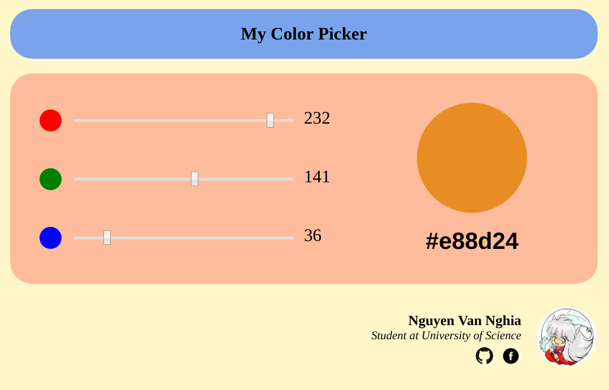

# Basic knowledge of Web development

# 1. Lý thuyết

## 1.1. Frontend Basic

### 1.1.1. HTML5

### 1.1.2. CSS3

### 1.1.3. Responsive Web Design

### 1.1.4. Màu sắc trong thiết kế Web

### 1.1.5. Một số CSS Framework

## 1.2. JavaScript

### 1.2.1. JavaScript Syntax

### 1.2.2. Async trong JavaScript

### 1.2.3. Closure

### 1.2.4. OOP trong JavaScript

### 1.2.5. Một số thư viện JavaScript

# 2. Bài tập

## 2.1. Basic JavaScript

## 2.2. Color Chooser

# 3. Tài liệu tham khảo

- [The Ultimate VSCode Setup for Front End/JS/React](https://medium.com/productivity-freak/the-ultimate-vscode-setup-for-js-react-6a4f7bd51a2)
- [Tutorial for HTML, CSS, JavaScript](https://www.w3schools.com/)
- [CORS](https://spring.io/understanding/CORS)
- [UI/UX](https://gitlab.zalopay.vn/vuongvx/ui-ux)