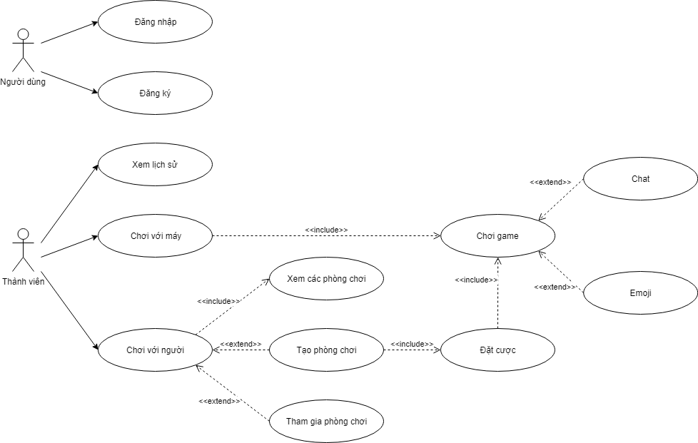
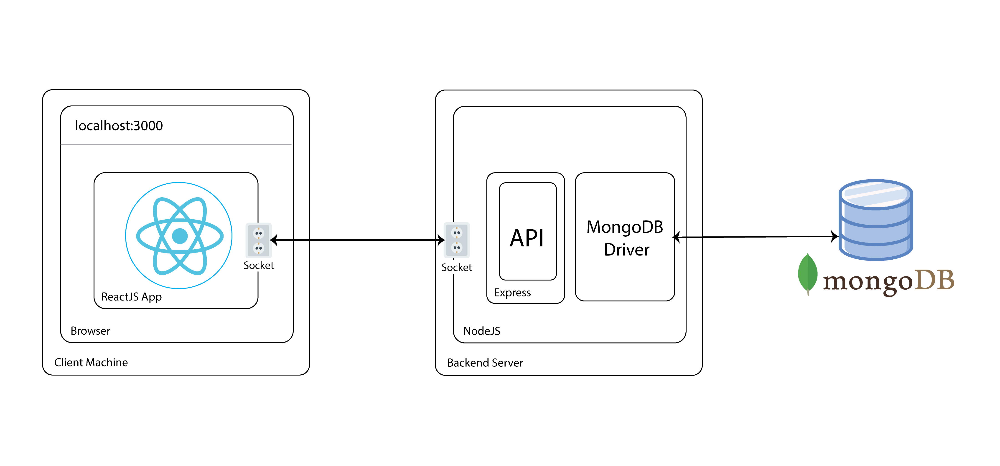
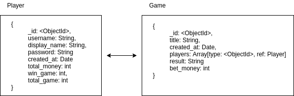

# Tài liệu thiết kế

# 1. Đặc tả yêu cầu

# 2. Sơ đồ usecase



# 3. Đối tượng người dùng

Actor trong sơ đồ usecase.

# 4. Kiến trúc hệ thống

- Mô hình chung:
    - Frontend: ReactJS
    - Backend: NodeJS
    - Database: MongoDB



# 5. Database design



# 6. Restful API Specification

## 6.1. Thiết kế API giao tiếp giữa frontend và backend

### POST /players/signup

- Tạo player.

- Chỉ thực hiện thành công nếu username chưa tồn tại trong database.

- Định dạng: application/json

- Request Body:

```
username: string
display_name: string
password: string
```

- Response:

    - 200:

    ```
    message: Signup successful
    ```

    - 400:

    ```
    message: Signup fail
    ```

### POST /players/login

- Đăng nhập tài khoản

- Chỉ thực hiện thành công nếu nhập đúng username và password

- Định dạng: application/json

- Request Body:

```
username: string
password: string
```

- Response:

    - 200:

    ```
    token: string
    user_id: string
    username: string
    ```

    - 400:

    ```
    message: Invalid username/password supplied
    ```

### GET /players

- Lấy thông tin của chính player

- Điều kiện tiên quyết: xác thực được JWT

- Request Header: `JWT`

- Response:

    - 200:

    ```
    username: string
    total_money: int
    win_game: int
    total_game: int
    games: Array
    ```

    - 400:

    ```
    message: BAD_REQUEST
    ```

### PUT /players

- Cập nhật thông tin của chính player.

- Điều kiện tiên quyết: xác thực được JWT

- Request Header: `JWT`

- Request Body:

```
total_money: int
win_game: int
total_game: int
```

- Response:

    - 200:

    ```
    message: update successful
    ```

    - 400:

    ```
    message: update fail
    ```

### POST /games

- Tạo game.

- Điều kiện tiên quyết: xác thực được JWT

- Request Header: `JWT`

- Request Body:

```
bet_money: int
```

- Response:

    - 200:

    ```
    game_id: string
    title: string
    ```

    - 400:

    ```
    message: BAD_REQUEST
    ```


### DELETE /games/{game_id}

- Xóa game.

- Điều kiện tiên quyết: xác thực được JWT

- Request Header: `JWT`

- Response:

    - 200:

    ```
    message: delete successful
    ```

    - 400:

    ```
    message: delete fail
    ```

### PUT /games/player

- Thêm thành viên tham gia game

- Điều kiện tiên quyết: xác thực được JWT

- Request Header: `JWT`

- Request Body:

```
game_id: string
```

- Response:

    - 200:

    ```
    message: join successful
    ```

    - 400:

    ```
    message: join fail
    ```

### PUT /games/result

- Cập nhật kết quả của game

- Điều kiện tiên quyết: xác thực được JWT

- Request Header: `JWT`

- Request Body:

```
game_id: string
result: string
```

- Response:

    - 200:

    ```
    message: update successful
    ```

    - 400:

    ```
    message: update fail
    ```

## 6.2. Thiết kế API cho phần Socket


# 7. Sequence diagram
