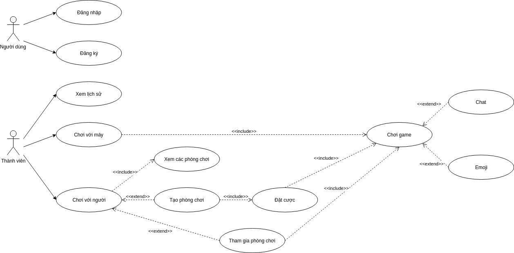

# Tài liệu thiết kế

# Đặc tả yêu cầu

# 1. Sơ đồ usecase

# 2. Đối tượng người dùng

Actor trong sơ đồ usecase.

# 3. Kiến trúc hệ thống

- Mô hình chung:
    - Frontend: ReactJS
    - Backend: NodeJS
    - Database: MongoDB

# 4. Database design

# 5. Restful API Specification

## 5.1. Thiết kế API giao tiếp giữa frontend và backend

## 5.2. Thiết kế API cho phần Socket

# 6. Sequence diagram
